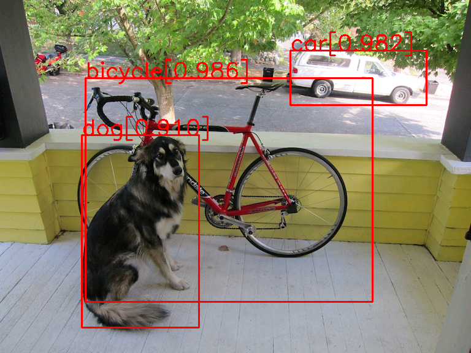

# my_ssd

Simple implementation of SSD-300 (Single Shot MultiBox Detector),
just for me to understand the process of this detector
____
## Example

____
## Performance

### Evalution on VOC 2007 test
#### mAP
| Method | Training Data | Mine | Paper |
|:-: |:-:|:-:|:-:|
| SSD300 | VOC 2007 trainval | 60.3% | 68.0% |
There is room for improvement...
____
## DEMO
### 1.Enviromental dependencies
requires pytorch >=0.41
- python3 is better
- install [pytorch](https://pytorch.org)
  ```shell
   # make sure pip3 is upgraded
   pip3 install torch torchvision
  ```
- install [chainercv](https://github.com/chainer/chainercv), following their
instructions, or you can install from pip
    ```shell
    pip3 install chainercv
    ```
- install opencv
    ```shell
    pip3 install opencv-python
    ```
- other libs: tqdm, PIL...

### 2.Train
Train the model with:
```shell
python3 main.py train
```
### 3.Test
Show the `dog` detection example by:
```shell
python3 main.py test
```
### 4.Eval
Evalute the model on VOC 2007 test by:
```shell
python3 main.py eval
```
____
## TODO

- [-] Roughly Implementation:
    - [-] ~~change lr~~
    - [X] train basicly

- [-] In Paper:
    - [-] ~~catch up performance reported in paper~~(If I'm free...)
    - [-] train on coco
- [-] More:
    - [-] change to DenseNet
    - [-] add deformable convolution

## References:
+ [SSD: Single Shot MultiBox Detector(Paper)](https://arxiv.org/abs/1512.02325)
+ [chenyuntc/dsod.pytorch](https://github.com/chenyuntc/dsod.pytorch)